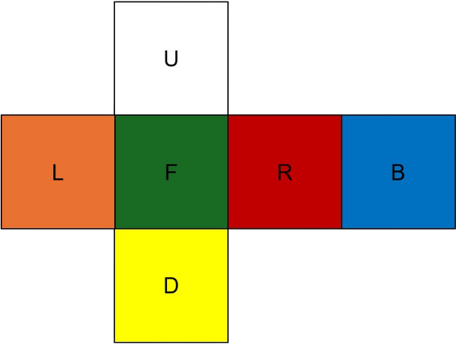
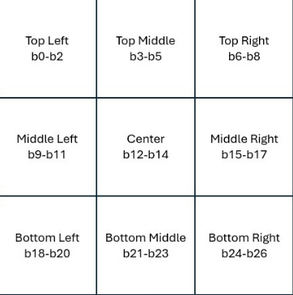
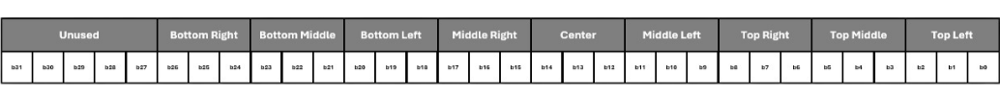

# Cubik

C++ module for emulating a Rubik's cube and its behaviors for implementing solving algorithms, search algorithms, and more.

## Usage

### Installation

To install simply run: `pip install cubik`

### Creating a Cube

```python
from cubik import Cube

cube = Cube()
print(cube)
```

Outputs:
```
      ⬜⬜⬜            
      ⬜⬜⬜            
      ⬜⬜⬜            
🟧🟧🟧🟩🟩🟩🟥🟥🟥🟦🟦🟦
🟧🟧🟧🟩🟩🟩🟥🟥🟥🟦🟦🟦
🟧🟧🟧🟩🟩🟩🟥🟥🟥🟦🟦🟦
      🟨🟨🟨            
      🟨🟨🟨            
      🟨🟨🟨    
```

### Applying a Move

```python
cube_R = cube.R() # applys R move
```

Note: *all move methods return a new cube*
This means that `cube` will be unchanged and `cube_R` is the result of applying a 'R' move to `cube`.

### Applying a Sequence of Moves

```python
from cubik import Cube, moves

cube = Cube()

checker_moves = [moves.M2, moves.E2, moves.S2] # sequence of moves to build a checker pattern on the cube

checkered_cube = cube.apply_moves(checker_moves)
```

Outputs:
```
      ⬜🟨⬜            
      🟨⬜🟨            
      ⬜🟨⬜            
🟧🟥🟧🟩🟦🟩🟥🟧🟥🟦🟩🟦
🟥🟧🟥🟦🟩🟦🟧🟥🟧🟩🟦🟩
🟧🟥🟧🟩🟦🟩🟥🟧🟥🟦🟩🟦
      🟨⬜🟨            
      ⬜🟨⬜            
      🟨⬜🟨   
```

### A Few Other Handy Functions and Features

```python
cube.is_solved() # returns true if the cube is solved, false otherwise
cube.get_state() # returns a tuple of 6 elements 

other_cube = cube()
other_cube == cube # true as both cubes are in equal states
other_cube.R() == cube.R() # ditto

other_cube != cube.R() # true because other_cube is not the as cube+R

```


## Rubik's Cube Notation

For cube notation please refer to [3x3 Rubik's Cube Move Notation](https://jperm.net/3x3/moves).

## Visualization

### Printed Model

Cube Layout:



*Coloring is based on the solved state and orientation*

### Memory Model
In this cube model we attempt to be as memory efficient as possible so, in memory each face is stored as a `uint32_t` such that:



*Fuzzy display of uint32_t storage of a face*



